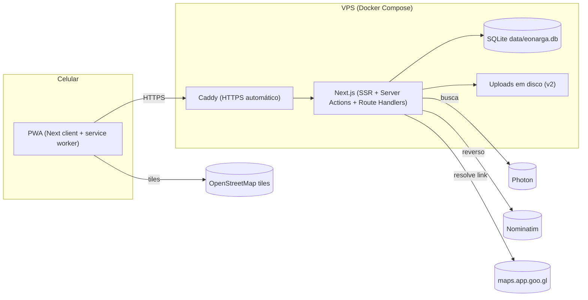

# 02 — Stack e arquitetura

## Critérios

O app é pequeno (dezenas de usuários no máximo, centenas de lugares), interno e sem SLA. Então:

1. **Um repositório, um container.** Front e back juntos.
2. **Sem serviço pago obrigatório.** Nada de chave de API com cartão de crédito no caminho crítico.
3. **Dados fáceis de levar embora.** Um arquivo `.db` e uma pasta de uploads.
4. **Ecossistema conhecido.** Se alguém do grupo quiser mexer, que seja em algo googlável.

## Stack proposta

| Camada              | Escolha                                                                            | Alternativa considerada                 | Motivo                                                                                                                                                                       |
| ------------------- | ---------------------------------------------------------------------------------- | --------------------------------------- | ---------------------------------------------------------------------------------------------------------------------------------------------------------------------------- |
| Framework           | **Next.js** (App Router, Server Actions, TypeScript)                               | SvelteKit; Vite SPA + Hono              | Um só projeto, render no servidor, ecossistema maior pra Tiptap, mapa e PWA. SvelteKit seria mais leve e é boa alternativa se você preferir                                  |
| UI                  | **Tailwind CSS v4 + shadcn/ui**                                                    | Mantine, DaisyUI                        | Componentes acessíveis, fáceis de customizar pro visual "meme"                                                                                                               |
| Banco               | **SQLite** via **Drizzle ORM** (`@libsql/client`)                                  | Postgres; Prisma                        | Zero infra. Drizzle gera migrations e tipa as queries. libsql permite trocar pra Turso sem mudar código                                                                      |
| Auth                | **Sessão própria** (cookie httpOnly + tabela `sessions`) + **argon2**              | Auth.js (credentials)                   | Auth.js complica o caso "admin cria usuário sem email". Sessão em banco são ~100 linhas e dá controle total                                                                  |
| Mapa                | **Leaflet** + `react-leaflet` + `leaflet.markercluster`                            | MapLibre GL + OpenFreeMap               | Leaflet é mais simples e leve pra pinos. MapLibre vale se quiser mapa vetorial mais bonito                                                                                   |
| Tiles               | **OpenStreetMap** padrão + filtro CSS (`invert` + `hue-rotate`) no tema escuro     | CARTO Dark Matter; OpenFreeMap          | A CARTO passou a exigir API key (tiles vêm com marca d'água). OSM é grátis pra uso baixo com atribuição                                                                      |
| Geocoding (busca)   | **Photon** (komoot, base OSM, feito pra autocomplete)                              | Nominatim; Google Places                | Grátis. Nominatim **proíbe** autocomplete na política de uso; Photon não. Cobertura de lojinha pequena é fraca em ambos, por isso "colar link do Maps" é o caminho principal |
| Geocoding (reverso) | **Nominatim** (toque no mapa → endereço)                                           | Photon reverse                          | 1 req/s, com User-Agent identificado, via proxy no servidor                                                                                                                  |
| Google Maps         | **Deep links** (abrir, rota) + **resolução de link compartilhado** no servidor     | Places API (New) com chave              | Cobre abrir, navegar e importar. Places API fica opcional atrás de env var                                                                                                   |
| Editor              | **Tiptap v3** (ProseMirror)                                                        | Milkdown (markdown-nativo); Lexical     | WYSIWYG maduro, mobile ok, atalhos markdown nativos. Salva HTML sanitizado                                                                                                   |
| Sanitização         | `sanitize-html` com allowlist espelhando as extensões do Tiptap                    | DOMPurify (isomorphic)                  | Roda no servidor sem DOM                                                                                                                                                     |
| Validação           | **Zod**                                                                            | Valibot                                 | Padrão                                                                                                                                                                       |
| Imagens (v2)        | **sharp** (redimensionar, remover EXIF, gerar thumb, converter pra webp)           | —                                       | Padrão; também gera os ícones do PWA                                                                                                                                         |
| PWA                 | **Serwist** (`@serwist/next`)                                                      | `next-pwa` (abandonado); Workbox manual | Sucessor mantido do next-pwa                                                                                                                                                 |
| Datas               | `date-fns` com locale `ptBR`                                                       | dayjs                                   | "há 2 dias", "ontem"                                                                                                                                                         |
| Testes              | **Vitest** (ranking, sanitização, parser de link) + **Playwright** (1 fluxo smoke) | —                                       | Pouco teste, mas nos pontos que quebram em silêncio                                                                                                                          |
| Lint/format         | ESLint + Prettier                                                                  | Biome                                   | Padrão do Next                                                                                                                                                               |
| Runtime             | Node 22 (já instalado) + **npm**                                                   | pnpm                                    | pnpm exige corepack, que no Windows pede admin pra criar os shims; npm já está lá e o projeto é pequeno                                                                      |
| Deploy              | **Docker Compose** (app + Caddy)                                                   | Vercel + Turso + R2                     | Ver "Hospedagem"                                                                                                                                                             |

### Por que não Supabase/Firebase

Resolveriam auth e banco, mas "admin cria usuário com senha" vira gambiarra com service key, e o app ficaria preso a um serviço. O ganho não paga.

### Por que não markdown puro no banco

Tiptap trabalha com JSON/HTML. Dá pra serializar markdown (`tiptap-markdown`), mas o round-trip perde coisas (imagem com tamanho, alinhamento). Guardamos **HTML sanitizado** como fonte da verdade e, se um dia quiser exportar, converte com `turndown`. O usuário não vê diferença: digita `**assim**` e vira negrito na hora.

## Arquitetura



- **Tudo passa pelo servidor Next.** Não há API pública; o cliente chama Server Actions (mutações) e páginas SSR (leitura). Route Handlers só pra upload, servir imagens e os proxies de geocoding.
- **Geocoding e resolução de link são proxied** pelo servidor: aplica o User-Agent exigido, rate limit, cache, e evita CORS.
- **Mapa carrega tiles direto** do provedor (é o padrão, e o service worker pode cachear).

## Estrutura do repositório

Raiz = esta pasta (`narga/`).

```
.
├── docs/                      # este plano
├── public/
│   ├── icons/                 # gerados a partir de eonarga.jpg (ver 06)
│   └── logo.jpg               # cópia do eonarga.jpg
├── src/
│   ├── app/
│   │   ├── (auth)/login/
│   │   ├── (auth)/trocar-senha/
│   │   ├── (app)/             # layout com navegação inferior, exige sessão
│   │   │   ├── page.tsx       # = ranking
│   │   │   ├── mapa/
│   │   │   ├── lugares/novo/
│   │   │   ├── lugares/[slug]/
│   │   │   ├── lugares/[slug]/avaliar/
│   │   │   ├── lugares/[slug]/editar/
│   │   │   ├── role/          # quero ir / já fui (+ sortear na v2)
│   │   │   ├── perfil/
│   │   │   └── admin/{usuarios,categorias}/
│   │   ├── api/
│   │   │   ├── geocode/       # proxy Photon + Nominatim
│   │   │   ├── maps-link/     # resolve link do Google Maps
│   │   │   └── uploads/       # v2: recebe e serve imagens
│   │   ├── manifest.ts
│   │   ├── sw.ts              # Serwist
│   │   └── ~offline/
│   ├── components/
│   │   ├── ui/                # shadcn
│   │   ├── map/               # Leaflet (dynamic import, sem SSR)
│   │   ├── editor/            # Tiptap + toolbar
│   │   ├── places/
│   │   └── reviews/
│   ├── actions/               # server actions por domínio (places, reviews, users...)
│   └── lib/
│       ├── db/                # client.ts, schema.ts, migrations/, seed.ts
│       ├── auth/              # session.ts, password.ts, guards.ts
│       ├── ranking.ts
│       ├── sanitize.ts
│       ├── maps-link.ts       # parser de links do Google Maps
│       ├── geocode.ts
│       └── storage.ts         # adapter: disco local (S3/R2 no futuro)
├── scripts/
│   └── generate-icons.ts      # sharp: jpg → ícones PWA/favicon
├── data/                      # volume: eonarga.db + uploads/ (gitignored)
├── Dockerfile
├── compose.yml
├── Caddyfile
├── .env.example
└── package.json
```

## Variáveis de ambiente

| Var                                             | Exemplo                                 | Obrigatória                         |
| ----------------------------------------------- | --------------------------------------- | ----------------------------------- |
| `DATABASE_URL`                                  | `file:./data/eonarga.db`                | sim                                 |
| `UPLOAD_DIR`                                    | `./data/uploads`                        | v2                                  |
| `APP_URL`                                       | `https://narga.schlutersolucoes.com.br` | sim (prod)                          |
| `NEXT_PUBLIC_CAPTCHA_MODE`                      | `always` \| `off`                       | não (padrão `always`; `off` em dev) |
| `ADMIN_NAME` / `ADMIN_EMAIL` / `ADMIN_PASSWORD` | usados só no primeiro seed              | sim (1ª vez)                        |
| `MAP_CENTER`                                    | `-27.5975,-48.5500`                     | não (padrão = Centro)               |
| `TILE_URL`                                      | URL do provedor de tiles                | não                                 |
| `GEOCODE_USER_AGENT`                            | `eonarga/1.0 (seu-email)`               | sim (política do Nominatim)         |
| `GOOGLE_MAPS_API_KEY`                           | —                                       | não (habilita Places Autocomplete)  |

## Hospedagem

**Decidido (02/09/2026): VPS próprio, domínio `eonarga.com.br` (atrás do proxy da Cloudflare).**

### Como está de fato no ar

O VPS já hospeda outros projetos e tem um **Caddy do sistema** nas portas 80/443, então o app não sobe o próprio Caddy lá. O que roda:

- Só o container do app, via `compose.prod.yml`, publicado em `127.0.0.1:3010` (a 3000 já é de outro projeto). Imagem `eonarga:<versão>`, construída na máquina de dev com `docker build` e enviada com `docker save | gzip` + `docker load`, porque o VPS tem 1 vCPU e 2 GB de RAM e não aguenta `next build`.
- Um site no `/etc/caddy/Caddyfile` do sistema, no mesmo padrão dos outros sites atrás da Cloudflare: bloco `http://eonarga.com.br` e bloco `https://eonarga.com.br` com `tls internal` (Cloudflare no modo Flexible/Full não-estrito), ambos com `reverse_proxy 127.0.0.1:3010`.
- Volume `eonarga_app_data` com o SQLite. Backup: `docker compose -f compose.prod.yml exec app tar cz -C /app/data . > backup.tgz`.

Atualizar: `docker build -t eonarga:X.Y.Z .` local → enviar → no VPS `EONARGA_TAG=X.Y.Z docker compose -f compose.prod.yml up -d`. Migrations rodam no start.

### Alternativa: VPS só nosso (compose.yml com Caddy próprio)

- Qualquer VPS Linux com Docker (1 vCPU / 1 GB sobra). Portas 80 e 443 abertas.
- `compose.yml`: serviço `app` (imagem multi-stage do Next em modo `standalone`) + `caddy` (HTTPS via Let's Encrypt).
- Volume nomeado `app_data` (montado em `/app/data`) com banco e uploads; `caddy_data` com os certificados. Volume nomeado em vez de bind mount porque o container roda como usuário sem privilégio e o Docker já cria o volume com o dono certo. Backup: comando no README do repo.
- Backup: cron diário com `sqlite3 .backup` + tar dos uploads pra um bucket, **ou** Litestream replicando o SQLite continuamente pra R2/S3 (um container a mais, backup contínuo de graça).
- PWA exige HTTPS; Caddy resolve.

### DNS (ainda não configurado)

No painel do `schlutersolucoes.com.br`, criar:

| Tipo | Nome    | Valor                 |
| ---- | ------- | --------------------- |
| A    | `narga` | IPv4 do VPS           |
| AAAA | `narga` | IPv6 do VPS, se tiver |

Se o DNS for Cloudflare, deixar o registro em "DNS only" (nuvem cinza). Com o proxy laranja o Caddy não consegue emitir o certificado pelo desafio HTTP sem ajuste extra; não vale a complexidade.

### Caddyfile

```
narga.schlutersolucoes.com.br {
    encode zstd gzip
    reverse_proxy app:3000
}
```

Só isso. Caddy emite e renova o certificado sozinho.

### Alternativa descartada: Vercel + Turso + R2

Zero servidor, mas três serviços pra configurar e fotos fora do "um arquivo, uma pasta". O código continua compatível (troca `DATABASE_URL` e o adapter de storage) caso mude de ideia.

## Ambiente de desenvolvimento

```bash
npm install
cp .env.example .env          # preencher ADMIN_*
npm run db:migrate && npm run db:seed
npm run dev                   # http://localhost:3000
npm run icons                 # gera public/icons a partir de eonarga.jpg
```

- `localhost` conta como contexto seguro: PWA e service worker funcionam em dev sem HTTPS.
- Pra testar no celular na mesma rede, `npm run dev -- -H 0.0.0.0` e abrir pelo IP. Aí o SW não registra (sem HTTPS); pra testar instalação de verdade, `docker compose up` com Caddy, ou um túnel (`cloudflared tunnel --url http://localhost:3000`).
- Windows: `sharp`, `@libsql/client` e `@node-rs/argon2` têm binários prontos pra win32-x64. Não precisa de toolchain C.
