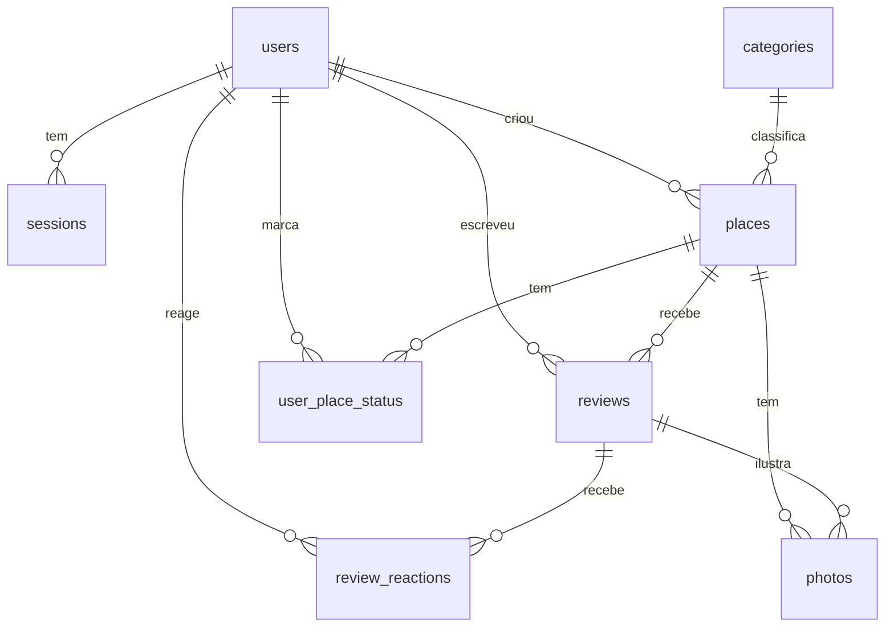

# 03 — Modelo de dados

SQLite, migrations geradas pelo Drizzle. IDs são `text` (nanoid) pra não vazar contagem e facilitar merge de backups. Datas em ISO 8601 UTC (`text`). Booleans em `integer` 0/1.

## Diagrama



## Tabelas

### users

| coluna                 | tipo        | notas                                                                                                         |
| ---------------------- | ----------- | ------------------------------------------------------------------------------------------------------------- |
| id                     | text pk     |                                                                                                               |
| name                   | text        | exibido em todo lugar                                                                                         |
| email                  | text unique | lower-case; é o login                                                                                         |
| password_hash          | text        | argon2id                                                                                                      |
| role                   | text        | `admin` \| `member`                                                                                           |
| is_active              | int (bool)  | desativado não loga; conteúdo permanece                                                                       |
| must_change_password   | int (bool)  | true ao criar / resetar senha                                                                                 |
| created_at, updated_at | text        |                                                                                                               |
| last_login_at          | text null   |                                                                                                               |
| gender                 | text null   | "Gênero". Admin: texto livre (≤ 40). Membro: só `homossexual` ou `transsexual`. Zoeira do grupo (docs/08 #25) |
| testosterone           | int null    | ng/dL. Membro: 0 a 1200. Admin: sem teto                                                                      |

### sessions

| coluna     | tipo      | notas                                                          |
| ---------- | --------- | -------------------------------------------------------------- |
| id         | text pk   | SHA-256 do token que vai no cookie (o token cru nunca é salvo) |
| user_id    | fk users  | on delete cascade                                              |
| expires_at | text      | 30 dias; renovada a cada uso se passou da metade               |
| created_at | text      |                                                                |
| user_agent | text null | pra listar "sessões ativas" no perfil (v2)                     |

### categories

| coluna     | tipo        | notas                                |
| ---------- | ----------- | ------------------------------------ |
| id         | text pk     |                                      |
| name       | text unique | "Sebo"                               |
| slug       | text unique | "sebo"                               |
| emoji      | text        | "📚"                                 |
| color      | text        | hex; usado no pino do mapa e na chip |
| sort_order | int         |                                      |

Seed inicial: Restaurante 🍽️, Bar 🍺, Café ☕, Lanchonete 🍔, Sebo 📚, Livraria 📖, Loja 🛍️, Tabacaria 💨, Outro 📍.

### places

| coluna                 | tipo          | notas                                                  |
| ---------------------- | ------------- | ------------------------------------------------------ |
| id                     | text pk       |                                                        |
| slug                   | text unique   | gerado do nome (ASCII), com sufixo numérico se colidir |
| name                   | text          |                                                        |
| category_id            | fk categories | restrict on delete                                     |
| description            | text null     | curta, texto simples, ≤ 280 chars                      |
| tips                   | text null     | "dicas" livres (o que pedir, quando ir)                |
| address                | text null     |                                                        |
| lat, lng               | real          | obrigatórios                                           |
| google_maps_url        | text null     | link canônico, ou o que a pessoa colou                 |
| google_place_id        | text null     | só se vier da Places API                               |
| instagram              | text null     | handle sem @                                           |
| website                | text null     |                                                        |
| price_level            | int null      | 1–4                                                    |
| has_narga              | text          | `yes` \| `no` \| `unknown` (padrão `unknown`)          |
| status                 | text          | `active` \| `archived`                                 |
| created_by             | fk users      |                                                        |
| created_at, updated_at | text          |                                                        |

Índices: `category_id`, `status`, `(lat, lng)` (pra "perto de mim" por bounding box).

### reviews

| coluna                 | tipo      | notas                                              |
| ---------------------- | --------- | -------------------------------------------------- |
| id                     | text pk   |                                                    |
| place_id               | fk places | cascade                                            |
| user_id                | fk users  |                                                    |
| rating                 | int       | **2–10** = 1,0 a 5,0 em meios pontos (evita float) |
| verdict                | text      | uma frase, ≤ 120 chars (a citação do card)         |
| content_html           | text      | Tiptap → `sanitize-html`; pode ser vazio           |
| visited_at             | text null | só data, sem hora                                  |
| created_at, updated_at | text      |                                                    |

Índice comum (não único) em `(place_id, user_id)`: uma pessoa pode ter várias avaliações no mesmo lugar, uma por visita (docs/08 #29). O unique antigo caiu na migration `0004`.

### user_place_status

| coluna     | tipo      | notas               |
| ---------- | --------- | ------------------- |
| user_id    | fk users  |                     |
| place_id   | fk places |                     |
| status     | text      | `want` \| `visited` |
| updated_at | text      |                     |

PK `(user_id, place_id)`. Criar review faz upsert pra `visited`.

### review_reactions

PK `(review_id, user_id, emoji)`. Emojis permitidos: lista fixa no código (👍 😂 🔥 🤮 💨).

### photos (v2, mas já modelado)

| coluna        | tipo            | notas                      |
| ------------- | --------------- | -------------------------- |
| id            | text pk         | também é o nome do arquivo |
| place_id      | fk places       |                            |
| review_id     | fk reviews null | null = foto "do lugar"     |
| uploaded_by   | fk users        |                            |
| width, height | int             |                            |
| created_at    | text            |                            |

Arquivos em `UPLOAD_DIR/{id}.webp` e `{id}.thumb.webp`.

## Ranking

### Problema

Média simples deixa um lugar com uma única nota 5 acima de um lugar com vinte notas 4,7.

### Solução: média bayesiana

```
score = (C * m + soma_das_notas) / (C + n)
```

- `n` = nº de avaliações do lugar (**todas as visitas contam**, inclusive duas da mesma pessoa)
- `m` = média global de todas as avaliações de lugares ativos
- `C` = peso do "prior" = **3** (equivale a: "até ter 3 avaliações, desconfio")

Desempate: maior `n`, depois `updated_at` mais recente, depois nome.

Com o volume esperado, é uma query com `GROUP BY` na hora; sem cache, sem coluna denormalizada. Se um dia ficar lento (não vai), materializa.

### Exibição

- A nota mostrada é a **média simples** ("4,5"), porque é o que a pessoa espera ler.
- A **posição** vem do score bayesiano. Pra não confundir ("por que 4,8 está abaixo de 4,6?"), o card sempre mostra o `(n)` e, quando `n < 3`, uma etiqueta "poucas notas".
- Lugar com 0 avaliações não entra no ranking; aparece numa seção "Ainda sem nota" no fim da lista, e no mapa em cinza.
- Selo "Aprovado pelo narga": média ≥ 4,5 e `n ≥ 3`.

### Filtro por categoria

Mesma fórmula, e `m` continua sendo a média global (não a da categoria), pra que rankings de categorias diferentes sejam comparáveis.

## Slugs e URLs

- `/lugares/sebo-do-joao`: slug do nome, ASCII, único.
- Renomear o lugar **não** muda o slug (links já compartilhados no grupo continuam valendo).

## Migração e seed

- `npm run db:generate` cria migration a partir do `schema.ts`; `npm run db:migrate` aplica (também roda no start do container).
- `npm run db:seed`: categorias + primeiro admin a partir de `ADMIN_*`. Idempotente: não duplica categoria, não cria admin se já existe algum.
